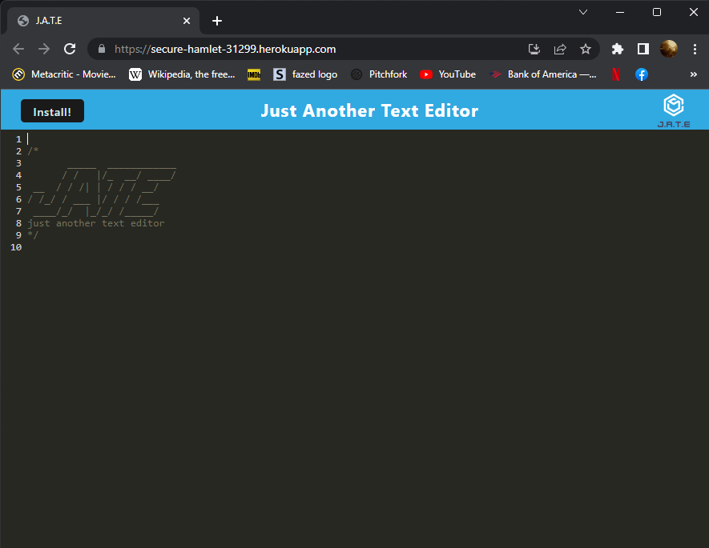

# Just Another Text Editor

<a href="#description">Description</a> •
<a href="#usage">Usage</a> •
<a href="#installation">Installation</a> •
<a href="#technologies-used">Technologies Used</a> •
<a href="#concepts-demonstrated">Concepts Demonstrated</a> •
<a href="#author">Author</a>

---

[Deployed Application](https://secure-hamlet-31299.herokuapp.com/)

---

## Description

This is just a simple text editor that allows you to enter some text. Whenever you make a change, the content is saved to [Web Storage](https://developer.mozilla.org/en-US/docs/Web/API/Web_Storage_API) as a backup. When the application loses focus, the content of the text editor is saved to a local database using [IndexedDB](https://developer.mozilla.org/en-US/docs/Web/API/IndexedDB_API).

It's a [Progressive Web App](https://developer.mozilla.org/en-US/docs/Web/Progressive_web_apps):

- It utilizes a [Service Worker](https://developer.mozilla.org/en-US/docs/Web/API/Service_Worker_API) to cache static assets and serve up cached content.
- It's bundled with [Webpack](https://webpack.js.org/) to make the code as small as possible to minimize load times.
- It can be installed locally.

## Usage

Navigate to: <https://secure-hamlet-31299.herokuapp.com/>. Type stuff in the box.

## Installation

Click the install button in the top-left corner of the screen. Click 'install' on the following prompt to install.

## Technologies Used

- PWA
- Webpack
- IndexedDB
- Node.js

## Concepts Demonstrated

- Knowledge of PWAs, service workers, resource caching, installing PWAs.
- Saving to a database using IndexedDB.
- Programming in a Node.js environment.

## Author

Adam Ferro

- [Github](https://github.com/GeminiAd)
